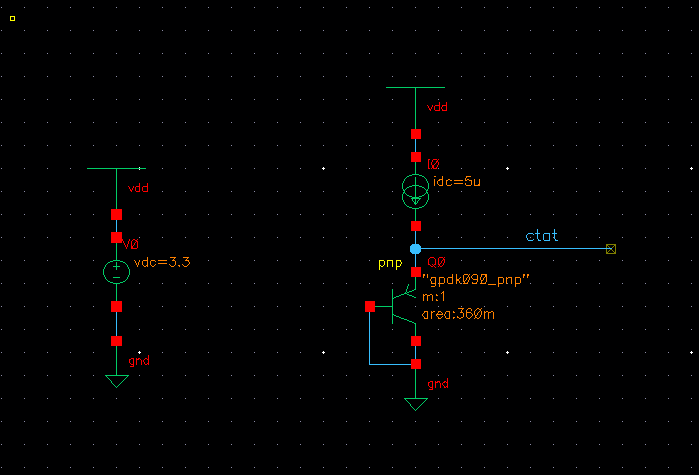
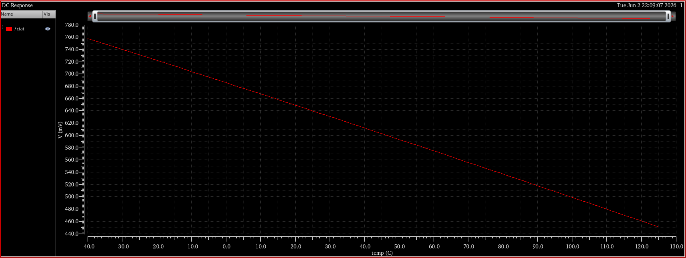
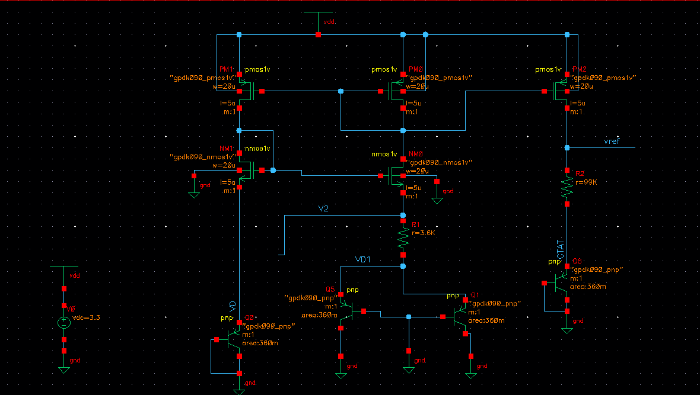
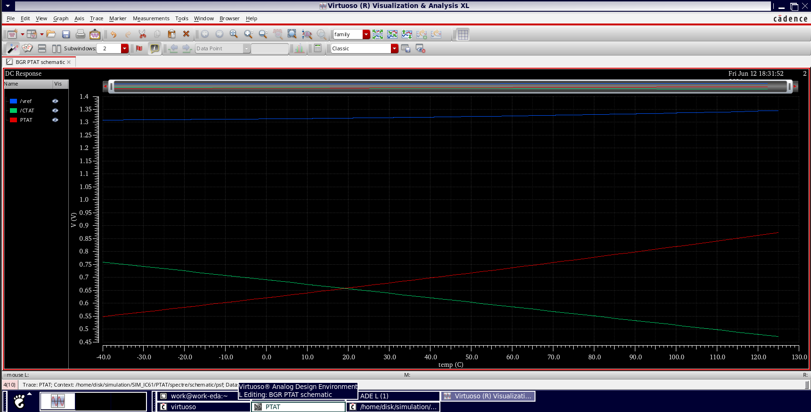

# Bandgap_Reference_Circuit_Cadence

A Bandgap Reference (BGR) circuit is a fundamental building block in integrated circuits, designed to provide a stable reference voltage that remains constant across variations in temperature, power supply, and fabrication process. This makes it an essential component in analog, mixed-signal, and digital systems.

## Understanding PTAT and CTAT Voltages
To achieve temperature independence, BGR circuits rely on two temperature-dependent voltage components:

- **PTAT (Proportional to Absolute Temperature):** This component increases linearly with temperature and is typically derived from the thermal voltage.

- **CTAT (Complementary to Absolute Temperature):** This component decreases linearly with temperature and is generated using the base-emitter voltage (V_BE) of a bipolar junction transistor (BJT).

By combining the PTAT and CTAT components in appropriate proportions, the temperature dependencies cancel each other out, resulting in a stable reference voltage.

***Note**: We cannot just add any PTAT with any CTAT to get a constant reference voltage, because they both need to cancel out each other completely in order to give a constant voltage.*

## 1. BGR with Current Mirror
This implementation uses a current mirror to combine PTAT and CTAT currents. The currents are mirrored and converted into voltages, which are then summed to generate the stable reference voltage. This approach is relatively simple and compact but may require precise current scaling to ensure accurate cancellation of temperature variations.

## 2. BGR with Op-Amp
This design incorporates an operational amplifier (op-amp) to achieve higher precision. The op-amp enforces proper feedback in the circuit, ensuring accurate voltage levels and improved stability by minimizing mismatches. The op-amp ensures equal voltages across the PTAT and CTAT branches, allowing for precise addition of the temperature-dependent components.
